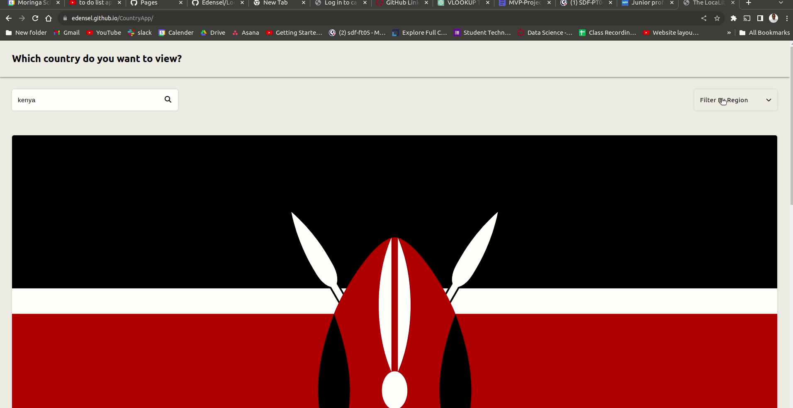

# The LocaLite Country App Finder

## Table of contents

- [Overview](#overview)
  - [The challenge](#the-challenge)
  - [Links](#links)
- [Built with](#built-with)
- [Author](#author)

## Overview! 👋

Thanks for checking out the LocaLite Country App Finder, a front-end coding challenge project.

## The Challenge

The task was to build a web application that allows users to search for countries, filter them by region, and view detailed information about a specific country. The application will be  integrate with the REST Countries API to fetch country data and display it in a user-friendly way.

### Links

- Solution URL:Github repository (https://github.com/Edensel/LocaLite.git)
- Live Site URL: LocaLite web application (https://edensel.github.io/LocaLite/)

### Key Features

- Search for countries by name.
- Filter countries by region.
- View detailed information about a specific country, including its name, population, region, subregion, capital, top-level domain, currencies, and languages.

## Where to Find Everything

The project provides you with the following files and resources:

- `index.html`: The HTML file where you'll structure the content of your web app.
- `index.js`: The JavaScript file for implementing the app's functionality.
- `style.css`: The CSS file for styling your web app.

## Building Your Project

You have complete control over how you structure your project and implement the features. Here's a suggested process to follow:

1. Set up a new GitHub repository for your project.
2. Create the HTML structure in `index.html`.
3. Write the basic styles in `style.css`.
4. Implement the core functionality using JavaScript in `index.js`.

### REST Countries API

To fetch data from the REST Countries API, you will make HTTP requests using JavaScript. You'll need to use JavaScript to fetch data and display it in your web app.
BASE URL link i used for the project (https://restcountries.com/v2/all)

## Author

- **Name**: Densel Esekon
- **Email**: esekondensel@gmail.com
